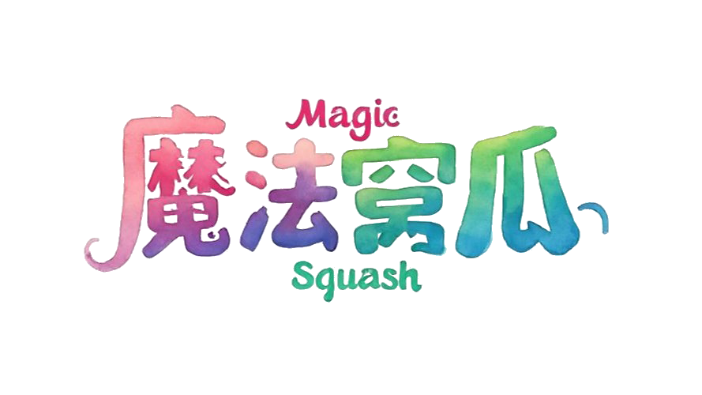

    <picture>
        
    </picture> 

---

任何足够先进的科技，皆与魔法无异 ——[亚瑟.克拉克](https://baike.baidu.com/item/%E4%BA%9A%E7%91%9F%C2%B7%E6%9F%A5%E7%90%86%E6%96%AF%C2%B7%E5%85%8B%E6%8B%89%E5%85%8B/213457)

## 博客内容

### 自由探索

- [The Surface of Venus from Venera 14](https://stupeter12138.github.io/explore/aerospace/apod)
- [对数概率](https://stupeter12138.github.io/explore/basic/logits)
- [挂谷猜想](https://stupeter12138.github.io/explore/basic/kakeya)
- [数学](https://stupeter12138.github.io/explore/basic/math)
- [海参崴](https://stupeter12138.github.io/explore/interesting/Vladivostok)
- [那么，什么是量子计算？](https://stupeter12138.github.io/explore/quantum/what)
- [魔法窝瓜专属表情包](https://stupeter12138.github.io/explore/interesting/memes)
- [黎曼](https://stupeter12138.github.io/explore/basic/riemann)
- [齐奥尔科夫斯基公式](https://stupeter12138.github.io/explore/aerospace/Tsiolkovsky)

### 机器学习

- [DQN](https://stupeter12138.github.io/ml/rl/dqn)
- [DeepSpeed-MoE 阅读笔记](https://stupeter12138.github.io/ml/papers/DS-MoE)
- [Group Relative Policy Optimization (GRPO)](https://stupeter12138.github.io/ml/papers/GRPO)
- [Hello, Agent](https://stupeter12138.github.io/ml/ai/agent)
- [Hello, RAG](https://stupeter12138.github.io/ml/ai/rag)
- [Marco-o1 让开源推理模型解决开放式问题](https://stupeter12138.github.io/ml/papers/Marco1)
- [MineStudio](https://stupeter12138.github.io/ml/papers/minestudio)
- [Optimus-2: Multimodal Minecraft Agent with Goal-Observation-Action Conditioned Policy](https://stupeter12138.github.io/ml/papers/optimus2)
- [Proximal Policy Optimization](https://stupeter12138.github.io/ml/rl/ppo)
- [TD 方法](https://stupeter12138.github.io/ml/rl/td)
- [The Oscars of AI Theater 阅读笔记](https://stupeter12138.github.io/ml/papers/AI_Oscars)
- [papers](https://stupeter12138.github.io/ml/papers/papers)
- [你好，强化学习](https://stupeter12138.github.io/ml/rl/rl)
- [动态规划](https://stupeter12138.github.io/ml/rl/dp)
- [大模型中的强化学习](https://stupeter12138.github.io/ml/rl/rl4llm)
- [大模型训练](https://stupeter12138.github.io/ml/ai/train)
- [来一起学机器学习吧🤗](https://stupeter12138.github.io/ml/hello)
- [策略梯度法](https://stupeter12138.github.io/ml/rl/pg)
- [蒙特卡洛方法](https://stupeter12138.github.io/ml/rl/mc)
- [贝尔曼方程](https://stupeter12138.github.io/ml/rl/bellman)
- [马尔可夫决策过程](https://stupeter12138.github.io/ml/rl/mdp)

### 技能与工具

- [Docker](https://stupeter12138.github.io/skills/automation/docker)
- [GitHub Action](https://stupeter12138.github.io/skills/automation/action)
- [Linux GPU 服务器常用命令语句指北](https://stupeter12138.github.io/skills/automation/server)
- [Markdown 语法指北](https://stupeter12138.github.io/skills/markdown/learningmd)
- [PSpice A/D分析电路特性](https://stupeter12138.github.io/skills/eda/orcad)
- [Python's best friend](https://stupeter12138.github.io/skills/automation/toml)
- [UV](https://stupeter12138.github.io/skills/automation/uv)
- [VIM 基础教程](https://stupeter12138.github.io/skills/markdown/vim)
- [latex 语法指北](https://stupeter12138.github.io/skills/markdown/latex)
- [工欲善其事，必先利其器](https://stupeter12138.github.io/skills/hello)

### 归途思语

- [从死亡、疯狂、自恋、创伤至情色](https://stupeter12138.github.io/thoughts/2024)
- [友谊](https://stupeter12138.github.io/thoughts/friendship)
- [归途思语](https://stupeter12138.github.io/thoughts/hello)
