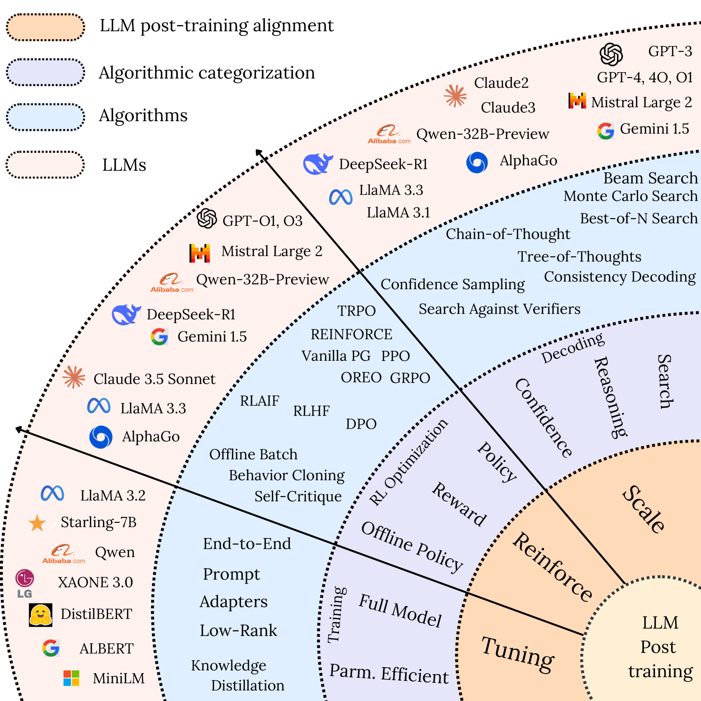
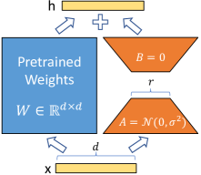

# 大模型的后训练

## Post-training

> 两篇综述：[^4][^5]

对于私有化，或有垂直行业需求的开发者，一般需要对模型进行二次训练（微调，对齐等），在训练后进行评测和部署。从训练角度来说，需求一般是：

- 具有大量未标注行业数据，需要重新进行CPT。一般使用Base模型进行。
- 具有大量问答数据对，需要进行SFT，根据数据量选用Base模型或Instruct模型进行。
- 需要模型具备独特的回复能力，额外做一次RLHF。
- 需要对模型特定领域推理能力（或思维链）增强，一般会用到蒸馏、采样微调或GRPO[^1]

### Fine-tuning

*微调预估显存消耗*[^2]

| Methods                         | Bits | 7B     | 14B   | 30B   | `n`B    |
| ------------------------------- | ---- | ------ | ----- | ----- | ------- |
| Full (`bf16` or `fp16`)         | 32   | 120 GB | 240GB | 600GB | `18n`GB |
| Full (`pure_bf16`)              | 16   | 60 GB  | 120GB | 300GB | `8n`GB  |
| Freeze/Lora/GaLore/APOLLO/BAdam | 16   | 16 GB  | 32GB  | 64GB  | `2n`GB  |
| QLoRA                           | 8    | 10 GB  | 20GB  | 40GB  | `n`GB   |
| QLoRA                           | 4    | 6 GB   | 12GB  | 24GB  | `n/2`GB |
| QLoRA                           | 2    | 4 GB   | 8GB   | 16GB  | `n/4`GB |

### Reinforcement Learing

*GRPO 全量微调显存需求*[^3]

| Method                | Bits | 1.5B   | 3B     | 7B     | 32B     |
| --------------------- | ---- | ------ | ------ | ------ | ------- |
| GRPO Full Fine-Tuning | AMP  | 2*24GB | 4*40GB | 8*40GB | 16*80GB |
| GRPO Full Fine-Tuning | BF16 | 1*24GB | 1*40GB | 4*40GB | 8*80GB |

### 训练框架

- [hiyouga/LLaMA-Factory: Unified Efficient Fine-Tuning of 100+ LLMs & VLMs (ACL 2024)](https://github.com/hiyouga/LLaMA-Factory)
- [modelscope/ms-swift: Use PEFT or Full-parameter to CPT/SFT/DPO/GRPO 500+ LLMs (Qwen3, Qwen3-MoE, Llama4, InternLM3, GLM4, Mistral, Yi1.5, DeepSeek-R1, ...) and 200+ MLLMs (Qwen2.5-VL, Qwen2.5-Omni, Qwen2-Audio, Ovis2, InternVL3, Llava, MiniCPM-V-2.6, GLM4v, Xcomposer2.5, DeepSeek-VL2, Phi4, GOT-OCR2, ...).](https://github.com/modelscope/ms-swift)

- [volcengine/verl: verl: Volcano Engine Reinforcement Learning for LLMs](https://github.com/volcengine/verl)

## LoRA

LoRA[^6]是一种参数高效微调方法，用于将大语言模型适应到下游任务。LoRA 显著减少了可训练参数的数量和 GPU 内存需求，同时实现了与完全微调相当甚至更优的性能，并且独特之处在于它不引入额外的推理延迟。

> 假设：适应过程中的权重更新具有较低的“内在秩。
>
> Weight updates during adaptation have a low "intrinsic rank.

对于任何预训练权重矩阵 $W_0 \in \mathbb{R}^{d \times k}$，LoRA 将权重更新 $\Delta W$ 表示为低秩分解：
$$
W = W_0 + \Delta W = W_0 + BA
$$
其中 $B \in \mathbb{R}^{d \times r}$ 和 $A \in \mathbb{R}^{r \times k}$ 的秩 $r \ll \min(d,k)$。

在训练期间，原始权重 $W_0$ 保持冻结，只训练小得多的矩阵 $A$ 和 $B$。前向传播变为：
$$
h = W_0x + \Delta Wx = W_0x + BAx
$$
其中： 

- 矩阵 $A$ 用随机高斯值初始化，而 $B$ 初始化为零，确保训练开始时 $\Delta W = 0$
- 对 $BAx$ 应用缩放因子 $\frac{\alpha}{r}$，以在改变秩 $r$ 时减少超参数敏感性

## Reference

[^1]: [Qwen3 X ModelScope工具链: 飞速训练 + 全面评测](https://mp.weixin.qq.com/s/VopxIcPOc4sQRthxYGVfyw)
[^2]: [xming521/WeClone: 欢迎star⭐。🚀从聊天记录创造数字分身的一站式解决方案💡 使用微信聊天记录微调大语言模型，让大模型有“那味儿”，并绑定到聊天机器人，实现自己的数字分身。 数字克隆/数字分身/数字永生/声音克隆/LLM/大语言模型/微信聊天机器人/LoRA](https://github.com/xming521/WeClone)

[^3]: [hiyouga/EasyR1: EasyR1: An Efficient, Scalabl](https://github.com/hiyouga/EasyR1)
[^4]: [LLM Post-Training: A Deep Dive into Reasoning Large Language Models | alphaXiv](https://www.alphaxiv.org/abs/2502.21321)

[^5]: [A Survey on Post-training of Large Language Models | alphaXiv](https://www.alphaxiv.org/abs/2503.06072)
[^6]: [[2106.09685\] LoRA: Low-Rank Adaptation of Large Language Models](https://arxiv.org/abs/2106.09685)

