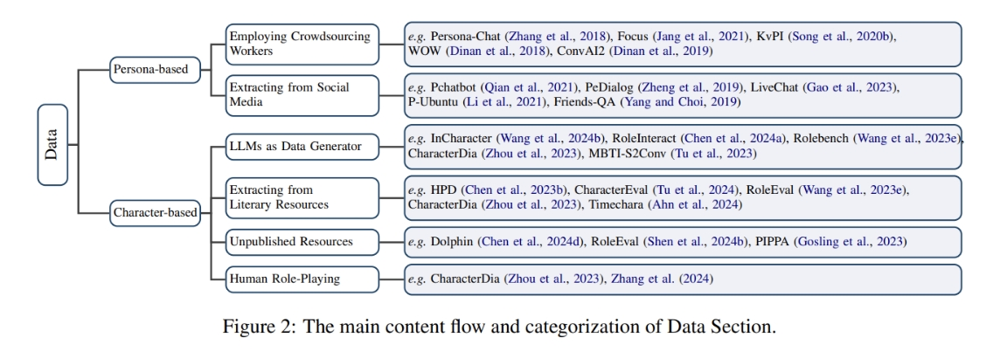

# The Oscars of AI Theater 阅读笔记

This practice of aligning LLMs with specific personas or characters is commonly konwn as Role-Playing, aiming to fulfill human needs at a psychological and entertainment level. 

key components in role-playing

### **Data** 

> diversity and complexity

Commonly, role-playing datasets contain two important components: **interactions** and **role-related information**.

Character-based role-playing scenarios involve simulating a broad spectrum of roles, categorized mainly into two categories: **real world-based** and **virtual scenario-based**.

- LLMs as Dta Generator

- Extracting from Literary Resources

- Unpublished Resources: *role-playing forums*(Blue Moon, NationStates, Aryion, ...) *online role-playing products*, *fanfiction communities*.

### **Model and alignment**

> Technically, we divide alignment approaches into Parameter-Tuning: Post-training, Supervised Fine-Tuning (SFT), and Reinforcement Learning; and Parameter-Frozen: In-context learning prompting and Retrieval-Augmented Generation (RAG).

Foundation models are critical in setting the base capability of role-playing models, which determine **the lower bounds** of performance and sophistication achievable in role-playing scenarios. A crucial step in pre-training an*effective foundation model for role-playing* involves incorporating *a substantial amount of novels* into the pretraining corpus, especially those with a worldview distinct from reality.

Alignment plays a crucial role in defining **the upper limits** of a model's role-playing ability. 

- Paramater-Tuning Alignment

    - Countinue-Pretrain 

    - Supervised Fine-Tuning(SFT)

    - Self-Alignment To improve weaker LLM by fine-tuning it on outputs from a stronger LLM.

    - Parameter-Efficiency Fine-Tuning(PEFT) PersonaPKT

    - Reinforcement Learning(RLHF) [详解大模型RLHF过程（配代码解读）](https://zhuanlan.zhihu.com/p/624589622)

    > The task of annotating high-quality preference data for role-playing is significantly more challenging than for a generic assistant, as it necessitates a deep understanding of the specific character to accurately annotate preferences.

- Paramater-Frozen Alignment

    - In-Context Learning(ICL) Prompting Typically, filling with role attributes, relations, task requirements within ICL, current LLMs can adapt to different roles swiftly.

    - Retrival Augmented Generation(RAG)

### **Agent architecture**

> Effective Role-Playing Language Agents (RPLAs) require a comprehensive system architecture that includes several key modules: **memory**, for recalling and utilizing past interactions; **planning**, for strategic decision-making; and **action**, which encompasses both generating role-related responses and using tools. Such complex architectures ensure RPLAs are not only interactive but also adaptive and context-aware, essential for complex role-playing scenarios.

The main content flow and categorization of Agent Architecture

- RPLAs often operate in environments that require them to remember and synthesize information over time, making memory modules an essential component of their architecture.

- By integrating such sophisticated planning and reflection capabilities, RPLAs can offer more dynamic and engaging experiences in role-play environments.

Agent actions are the culmination of prior planning, memory utilization, and interactions.

### **Evaluation**

> A composite approach, utilizing multiple metrics in tandem, is essential for a comprehensive evaluation.

- Conversation Ability

    - Linguistic Quality

    - Coherence

- Role-Rersona Consistency

    - Attributes

    - Relations

- Role-Behavior Consistency

    - Conversational Style

    - Personality

    - Linguistic Features

- Role-Playing Attractiveness

    Delta PPL emphasizes the use of relative automatic metrics, to gauge the model's role-playing capability using triplets like $(x, y_{win}, y_{lose})$.

    This is the most advanced level, where the role-playing models not only maintain persona and behavioral consistency but also enhances the interaction by being engaging, proactive, and empathetic.

To evaluate role-playing language models on the aforementioned dimensions, existing methods can be categorized into three main types: Reference-based, human-based, and LLM-based evaluation.

**Reference-based metrics** are efficient and objective, providing quick, quantifiable results ideal for preliminary assessments, though they lack depth and context sensitivity, failing to capture nuances like persona consistency. **Human-based evaluations** offer deep insights into nuances and subtleties in dialogues, including character alignment and user engagement, but are costly and less scalable, with potential for subjective variability between evaluators. **LLM-based evaluations**, leveraging the capabilities of large language models, offer scalability and speed and can mimic some aspects of human judgment, yet they may not always align with human evaluations and depend heavily on the used LLMs.

### Challenges and Future Directions

- More Reference-based Metrics for evaluating Role-Playing

- Sensitivity in LLM-Based Evaluation

- Imbalance, Bias and Cost in Human-based Evaluation

- Lack of deeper Role-specific Alignment Approaches

- Ensure the safety in Role-Playing

- Hallucination in Role-Playing

In general, the advancement of role-playing language models faces numerous challenges, including **the development of specific evaluation metrics**, **efficient memory management**, **ensuring role alignment**, **maintaining safety**, and **facilitating lifelong learning**.

### Referances

[The Oscars of AI Theater: A survey on Role-Playing with Language Models](https://arxiv.org/abs/2407.11484)

