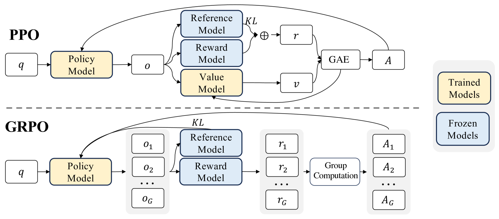

# Group Relative Policy Optimization (GRPO)

**DeepSeekMath + TRL + verl(TODO)**

## Introduction

> The mathematical reasoning capability of DeepSeekMath is attributed to two key factors: First, we harness the significant potential of publicly available web data through a meticulously engineered data selection pipeline. Second, we introduce Group Relative Policy Optimization (GRPO), a variant of Proximal Policy Optimization (PPO), that enhances mathematical reasoning abilities while concurrently optimizing the memory usage of PPO.

- 精心设计的数据筛选流程

- 群体相对策略优化算法 (GRPO)

**一些观察（结论？）**

- 模型的数学训练不仅增强数学能力，还放大了一般推理能力
- 统一范式下，不同的方法都被概念化为直接或简化的 RL 技术
- 参数量并非数学推理能力的唯一关键因素，高质量数据集也十分重要
- 先验的代码训练可以提高模型解决数学问题的能力/推理能力
- ArXiv 论文似乎在改进数学推理方面无效
- 强化学习过程中，模型跨领域性能有所提升
- 以英语为中心的数学语料库可能阻碍中文数学推理的表现
- 实时数据采样将提供更大的优势
- 使用细粒度、阶跃感知梯度系数，迭代 RL 可以显著提高性能
- RL 通过使输出分布更加稳健来提高模型的整体性能，似乎归因于提高 Top K 的正确响应

## Data

## Reinforcement Learning

Generally, the gradient with respect to the parameter θ of a training method can be written as:
$$
\nabla_{\theta} \mathcal{J}_\mathcal{A}(\theta) = \mathbb{E} [ \underbrace{(q, o) \sim \mathcal{D}}_{Data \ Source} ] \left( \frac{1}{|o|} \sum_{t=1}^{|o|} \underbrace{G C_{\mathcal{A}}(q, o, t, \pi_{\text{ref}})}_{Gradient \ Coefficient} \nabla_{\theta} \log \pi_{\theta}(o_t \mid q, o_{<t}) \right)
$$
GPRO formula:
$$
\begin{aligned}
\mathcal{J}_{GRPO}(\theta) = & \mathbb{E} \left[ q \sim P(Q)\, , \left\{ o_{i}\, \right\}_{i=1}^G \sim \pi_{\theta_{\text{old}}}(O \, |\, q)\, \right]
\\
&\quad \frac{1}{G} \sum_{i=1}^G \frac{1}{| o_{i} |} \sum_{t=1}^{| o_{i} |} \Bigg\{\ \min \left[ \frac{\pi_\theta( o_{i,t} | q, o_{i, < t} )}{\pi_{\theta_{\text{old}}}( o_{i,t} | q, o_{i, < t} )} \hat{A}_{i,t}, \right. 
\\
&\quad \left. \text{clip}\left( \frac{\pi_\theta( o_{i,t} | q, o_{i, < t} )}{\pi_{\theta_{\text{old}}}( o_{i,t} | q, o_{i, < t} )}, 1-\varepsilon, 1+\varepsilon \right) \hat{A}_{i,t} \right] - \beta \mathbb{D}_{\text{KL}} \big[ \pi_\theta \, \|\, \pi_{\text{ref}} \big] \Bigg\}    
\end{aligned}
$$

Estimating the KL divergence(评估两个模型的相似度):
$$
\mathbb{D}_{\text{KL}} \big[ \pi_\theta \, \|\, \pi_{\text{ref}} \big] = \frac{\pi_{\text{ref}}(o_{i,t} \mid q, o_{i, <t})}{\pi_{\theta}(o_{i,t} \mid q, o_{i, <t})} - \log \frac{\pi_{\text{ref}}(o_{i,t} \mid q, o_{i, <t})}{\pi_{\theta}(o_{i,t} \mid q, o_{i, <t})} - 1
$$

Computing the advantage: 
$$
\hat{A}_{i , t} = \tilde{r}_{i} =  \frac{r_i - \text{mean(r)}}{\text{std(r)}}
$$

Loss (in original TRL):
$$
\mathcal{L}_{GRPO}(\theta) = - \frac{1}{G} \sum_{i=1}^G \frac{1}{| o_{i} |} \sum_{t=1}^{| o_{i} |} \Bigg[ \frac{\pi_\theta( o_{i,t} | q, o_{i, < t} )} { [ \pi_{\theta}( o_{i,t} | q, o_{i, < t} ) ]_{no \ grad} } \hat{A}_{i,t}  - \beta \mathbb{D}_{\text{KL}} \big[ \pi_\theta \, \|\, \pi_{\text{ref}}] \Bigg]
$$

> where clip(⋅,1−ϵ,1+ϵ)clip(⋅,1−*ϵ*,1+*ϵ*) ensures that updates do not deviate excessively from the reference policy by bounding the policy ratio between 1−ϵ1−*ϵ* and 1+ϵ1+*ϵ*. In TRL though, as in the original paper, **we only do one update per generation**, so we can simplify the loss to the first form.

- 结果监督 RL
- 过程监督 RL
- 迭代 RL：训练 Reward Model 以保证对不断更新的 Policy Model 的合理评估

## Reference

[deepseek-ai/DeepSeek-Math](https://github.com/deepseek-ai/DeepSeek-Math)

[GRPO Trainer](https://hf-mirror.com/docs/trl/grpo_trainer)