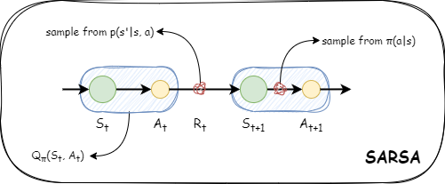

# TD 方法

蒙特卡洛方法只能用于回合制任务。而且当完成一个回合的时间很长时，蒙特卡洛方法也会消耗大量时间来更新价值函数。那么有没有一种不使用环境模型，而且每次行动时都会更新价值函数的方法呢？

> 有的兄弟，有的

时间差分方法（Temporal Difference, TD）：该方法不需要等待回合的结束，每过一定的时间就会进行策略的评估和改进。

## 评估策略

> TD 方法 = MC 方法 + DP 方法

$$
\begin{aligned}
v_\pi(s) &= \sum_{a, s'} {\pi}(a | s) p(s' | s,a) \left\{ r(s, a, s') + {\gamma}v_{\pi}(s') \right\} \\
&= \mathbb{E}_\pi \left[ {R_t + \gamma v_\pi(S_{t + 1})} \, | \, S_t = s  \right]
\end{aligned}
$$

具体来说，TD 方法只使用下一个行动和价值函数来更新当前的价值函数。

- 像 DP 方法一样，通过“自举”的方式就能依次更新价值函数。
- 像 MC 方法一样，无须了解环境相关的知识，使用采样数据就能对价值函数进行更新。

TD 方法的更新式如下所示：
$$
V_\pi'(S_t) = V_\pi(S_t) + \alpha \{ {R_t + \gamma V_\pi(S_{t + 1})} - V_\pi(S_t) \}
$$
其中，${R_t + \gamma v_\pi(S_{t + 1})}$ 叫做 TD 目标，TD 方法会朝着 TD 目标的方向更新 $V_\pi(S_t)$。

## 策略控制

### on-policy SARSA

将 TD 方法中的状态价值函数改为行动价值函数，就是以 Q 函数为对象的 TD 方法的更新式。
$$
Q_\pi'(S_t, A_t) = Q_\pi(S_t, A_t) + \alpha \{ {R_t + \gamma Q_\pi(S_{t + 1}, A_{t + 1})} - Q_\pi(S_t, A_t) \}
$$


Q 函数会将状态和行动的数据视为一个整体。



状态 $S_t$ 的策略可以按以下式子更新。
$$
\pi'(a | S_t) = \begin{cases}
\mathop{\arg\max}_a Q_\pi(S_t, a) \, , P = 1 - \epsilon \\
\text{随机行动} \, , P = \epsilon
\end{cases}
$$
用以上两个式子交替重复，就能接近最优的策略。这就是 SARSA 算法。

### off-policy SARSA

在异策略型的情况下，智能代理首先会基于行为策略，通过采取各种行动收集大量样本数据，然后使用样本数据贪婪地更新目标策略。

- 如果行为策略和目标策略的概率分布相似，则结果会更稳定。考虑到这一点，我们对当前的 Q 函数的行为策略进行 $\epsilon-\text{greedy}$ 更新，对目标策略进行贪婪更新。
- 由于两种策略不同，因此我们使用重要性采样来校正权重 p。

当行动 $A_{t + 1}$ 由策略 $b$ 进行采样时，我们通过权重 $\rho$ 来修正 TD 目标（重要性采样）。权重 $\rho$ 是策略为 $\pi$ 时获得 TD 目标的概率与策略为 $b$ 时获得 TD 目标的概率之比。
$$
\rho = \frac{\pi(A_{t + 1} | S_{t + 1})}{b(A_{t + 1} | S_{t + 1})}
$$
因此，异策略型 SARSA 的更新式如下所示，行动基于策略 $b$ 进行采样，TD 目标基于权重 $\rho$ 进行修正。
$$
\begin{aligned}
& \it{sampling:} \, A_{t + 1} \sim b \\
& Q_\pi'(S_t, A_t) = Q_\pi(S_t, A_t) + \alpha \left\{ \rho \left( {R_t + \gamma Q_\pi(S_{t + 1}, A_{t + 1})} \right) - Q_\pi(S_t, A_t) \right\}
\end{aligned}
$$

## Q 学习

> 如果用数学公式来表示 Q 学习，那么只需几行即可。不过，就算记住这些公式也不能让你更接近强化学习的本质（而且死记硬背也没什么意思）。

重要性采样的问题是结果容易变得不稳定。尤其是在两种策略的概率分布不同的情况下，差异越大，重要性采样中使用的权重 $\rho$ 的变化也就越大。这会导致 SARSA 更新式中的目标跟着发生变化，从而使 Q 函数的更新变得不稳定。

解决这个问题的方法就是 Q 学习（Q-learning）。

- 采用 TD 方法
- 是异策略型（off-policy）
- 不使用重要性采样


在 Q 学习中，估计值 $Q()$ 的目标是。Q 学习会沿着这个目标的方向更新 Q 函数。
$$
Q'(S_t, A_t) = Q(S_t, A_t) + \alpha \left\{ {R_t + \gamma \max_a Q(S_{t + 1}, a)} - Q_\pi(S_t, A_t) \right\}
$$
值得注意的是，行动 $A_{t + 1} \, (a)$ 并不是根据某个策略采样得到的，而是由 max 算子选择的。因此，无须通过重要性采样进行修正。

综上所述，Q 学习是一种异策略型方法。它拥有目标策略和行为策略这两种策略，其中行为策略 $b$ 会进行探索。常用的行为策略是对现在的估计值的 Q 函数进行 $\epsilon-\text{greedy}$ 化的策略。一旦确定了行为策略，智能代理就会基于该策略选择行动，并收集样本数据。每当智能代理采取行动时，都会使用上述表达式更新 Q 函数。这就是 Q 学习。

## 神经网络和 Q 学习

用简介紧凑的函数近似 Q 函数，最有力的方法就是深度学习了。

> 对于形状复杂的函数，在大多数情况下，梯度指示的方向不一定有最大值（或者在与梯度相反的方向不一定有最小值）。但如果只看局部区域，那么梯度指示的就是函数输出增加最大的方向。因此，如果重复进行沿着梯度的方向前进某个距离、在新的地点再次求出梯度，我们就有望慢慢接近目标位置（最大值或最小值）。这就是梯度下降法（gradient descent）。

```python
import numpy as np
import matplotlib.pyplot as plt
import torch
import torch.nn as nn
import torch.optim as optim
from common.gridworld import GridWorld  # 请确保环境类的实现与原先一致

def one_hot(state):
    HEIGHT, WIDTH = 3, 4
    vec = np.zeros(HEIGHT * WIDTH, dtype=np.float32)
    y, x = state
    idx = WIDTH * y + x
    vec[idx] = 1.0
    return vec[np.newaxis, :]  # 形状为 (1, 12)

class QNet(nn.Module):
    def __init__(self):
        super().__init__()
        self.fc1 = nn.Linear(12, 100)  # 输入维度为 12 (3x4 的 one-hot 向量)
        self.fc2 = nn.Linear(100, 4)   # 输出维度为 4 (动作数)

    def forward(self, x):
        # x 的形状期望为 (batch_size, 12)
        x = torch.relu(self.fc1(x))
        x = self.fc2(x)
        return x

class QLearningAgent:
    def __init__(self):
        self.gamma = 0.9
        self.lr = 0.01
        self.epsilon = 0.1
        self.action_size = 4

        self.qnet = QNet()
        self.optimizer = optim.SGD(self.qnet.parameters(), lr=self.lr)
        self.loss_fn = nn.MSELoss()

    def get_action(self, state_vec):
        # 以 epsilon 的概率随机选择动作，否则选择 Q 值最大的动作
        if np.random.rand() < self.epsilon:
            return np.random.choice(self.action_size)
        else:
            state_tensor = torch.tensor(state_vec, dtype=torch.float32)
            with torch.no_grad():
                qs = self.qnet(state_tensor)
            return torch.argmax(qs).item()

    def update(self, state, action, reward, next_state, done):
        state_tensor = torch.tensor(state, dtype=torch.float32)
        next_state_tensor = torch.tensor(next_state, dtype=torch.float32)

        qs = self.qnet(state_tensor)
        current_q = qs[0, action]

        if done:
            max_next_q = 0.0
        else:
            with torch.no_grad():
                next_q_vals = self.qnet(next_state_tensor)
            max_next_q = next_q_vals.max().item()

        # 计算 TD 目标
        target = reward + self.gamma * max_next_q
        target = torch.tensor(target, dtype=torch.float32)

        loss = self.loss_fn(current_q, target)

        self.optimizer.zero_grad()
        loss.backward()
        self.optimizer.step()

        return loss.item()

if __name__ == "__main__":
    env = GridWorld()
    agent = QLearningAgent()

    episodes = 1000
    loss_history = []

    for episode in range(episodes):
        state = env.reset()
        state_vec = one_hot(state)
        total_loss, cnt = 0, 0
        done = False

        while not done:
            action = agent.get_action(state_vec)
            next_state, reward, done = env.step(action)
            next_state_vec = one_hot(next_state)

            loss = agent.update(state_vec, action, reward, next_state_vec, done)
            total_loss += loss
            cnt += 1

            state_vec = next_state_vec

        average_loss = total_loss / cnt if cnt > 0 else 0
        loss_history.append(average_loss)
        print(f"Episode {episode}: 平均损失 {average_loss:.4f}")

    plt.xlabel('Episode')
    plt.ylabel('Loss')
    plt.plot(range(len(loss_history)), loss_history)
    plt.show()

    # 可视化 Q 值
    Q = {}
    for state in env.states():
        state_vec = one_hot(state)
        state_tensor = torch.tensor(state_vec, dtype=torch.float32)
        with torch.no_grad():
            qs = agent.qnet(state_tensor)
        for action in range(agent.action_size):
            Q[(state, action)] = qs[0, action].item()
    env.render_q(Q)
```

