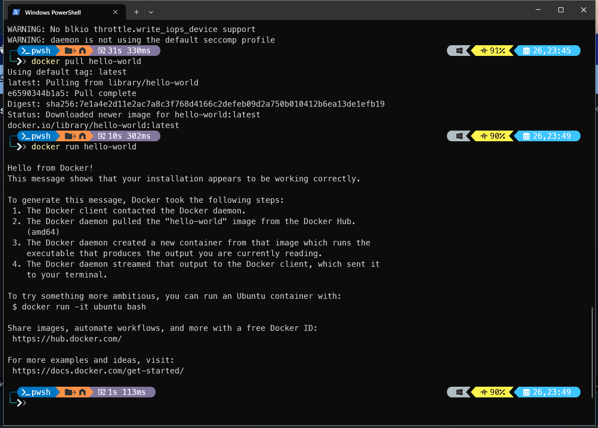

# Docker

## 安装指南

[Get Docker Desktop | Docker Docs](https://docs.docker.com/get-started/introduction/get-docker-desktop/)

## 配置文件

我的配置文件：

```json
{
  "builder": {
    "gc": {
      "defaultKeepStorage": "20GB",
      "enabled": true
    }
  },
  "experimental": false,
  "registry-mirrors": [
    "https://docker.m.daocloud.io",
    "https://docker.imgdb.de",
    "https://docker-0.unsee.tech",
    "https://docker.hlmirror.com",
    "https://docker.1ms.run",
    "https://func.ink",
    "https://lispy.org",
    "https://docker.xiaogenban1993.com"
  ]
}
```

## 常用命令

```bash
# lets start!

docker pull hello-world

docker run hello-world
```



```bash
docker --version

docker ps [-a]

docker images

docker run --help
```

- 容器是对镜像的虚拟实例化

## Dockerfile

todo

