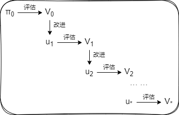

# 动态规划

使用贝尔曼方程，我们可以从状态迁移概率 $p(s' | s,a)$、奖励函数 $r(s,a,s')$ 和策略 $\pi(a | s)$ 这 3 条信息中得到联立方程，然后使用求解联立方程的程序（联立方程求解器）求出价值函数。但在实践中，当状态和行动模式的数量稍有增加，这种方法就会变得难以使用。动态规划法（dynamic programming,  DP）应运而生。

## 动态规划和策略评估

强化学习的问题通常涉及两项任务：

- 策略评估（policy evaluation）：求给定策略 $\pi$ 的价值函数 $v_{\pi}(s)$ 和 $q_{\pi}(s,a)$
- 策略控制（policy control）：控制策略并将其调整为最优策略

强化学习的最终目标是策略控制。但要实现这一目标，首先享解决的常常是策略评估。这是因为在大部分情况下，我们很难直接获得最优策略。

DP 的思路是将贝尔曼方程转化成“更新式”，数学表达式如下：
$$
V_{k + 1}(s) = \sum_{a, s'} {\pi}(a | s) p(s' | s,a) \left\{ r(s, a, s') + {\gamma}V_{k}(s') \right\}
$$
其中，$V_{i}(s)$ 表示的是第 $i$ 次进行更新的价值函数，是“推测值”，而非真正的价值函数。

DP 的特点是使用“下一个可能状态的价值函数 $V_{k}(s')$”来更新“目前所处状态的价值函数 $V_{k + 1}(s)$”。我们在这里所做的是用估计值 $V_{k}(s')$ 来改进另一个估计值 $V_{k + 1}(s)$。这种用估计值来改进估计值的过程叫作自举法（bootstrapping）。

具体来讲，我们首先为 $V_0(s)$ 设置初始值（比如在所有状态下进行 $V_0(s)=0$ 的初始化操作）。然后利用上述表达式，基于 $V_0(s)$ 更新 $V_1(s)$。接下来根据 $V_1(s)$ 更新 $V_2(s)$。通过重复这个过程，我们就接近了最终的目标 $v{\pi}(s)$。这种算法被称为**迭代策略评估**（iterative policy evaluation）。

> DP 是一类算法的总称，一般指的是通过将目标问题划分为更小的的问题来求出答案的方法。其本质是“不进行两次相同的计算”。

## 策略迭代法

除了对策略进行评估，我们还可以对策略进行改进。

对与当前策略 $\mu(s)$，有新策略：
$$
\begin{aligned}
\mu'(s) &= \mathop{\arg\max}_a \, q_{\mu}(s, a) \\
&= \mathop{\arg\max}_a \sum_{s'} p(s' | s,a) \left\{ r(s, a, s') + {\gamma}v_{\mu}(s') \right\}
\end{aligned}
$$
这种更新策略的做法叫做“贪婪化”，其特点是：

- 策略总是被改进。
- 如果该策略没有被改进（或更新），即在所有状态 $s$ 下 $\mu(s)$ 和 $\mu'(s)$ 都是一样的，那么它就是最优策略。

这个流程写下来是这样的：

1. 首先从策略 $\pi_0$​ 开始。由于策略 $\pi_0$ 也可能是随机性策略，因此可以用 $\pi_0(s|a)$来表示，而不表示为 $ \mu_0(s)$。
2. 然后对策略 $\pi_0$ 的价值函数进行评估，得到 $V_0$。这个过程可以通过选代策略评估算法来进行。
3. 接下来使用价值函数 $V_0$ 进行贪婪化（更新策略）。由于贪婪化策略总是选择一个行动，因此得到确定性策略 $\mu_1$。
4. 重复这个流程。

如果将此过程持续下去，那么就会达到策略不再因贪婪化而变更的一个点。此时的策略就是最优策略。这种重复评估和改进的算法叫作策略迭代法（policy iteration）。

> 在智能代理没有实际采取任何行动的情况下找出最优策略的问题叫作规划（planning）问题，正是本节讨论的问题。

## 价值迭代法

在策略迭代法中，不仅要最大限度地进行评估和改进，而且要交替切换这两个阶段。那么如果最小限度地进行评估和改进，会发生什么呢？这就引出了接下来我们要介绍的价值迭代法（value iteration）。

之前的方法中，所有状态的价值函数被多次进行更新。一旦更新过程收敛，接下来就是“改进”（贪婪化）阶段。与之相反的更新方法是一次只更新一个状态，然后立即进入“改进”阶段。这就是价值迭代法的核心思想。

价值迭代法通过以下表达式来获得最优价值函数：
$$
V_{k + 1}(s) = \max_a \sum_{s'} p(s' | s,a) \left\{ r(s, a, s') + {\gamma}V_{k}(s') \right\}
$$
值得注意的是，此时价值函数的更新并没有使用策略。应为当策略经过改进后，后就变成了贪婪策略。因其确定性，它只需要选择一个取最大值的行动，正如式子中使用 $\max$ 算子更新价值函数。价值迭代法通过这一个式子进行评估和改进。通过更新，可以得到最优价值函数。

> 回忆一下发现，这正是贝尔曼最优方程的“更新式”。

