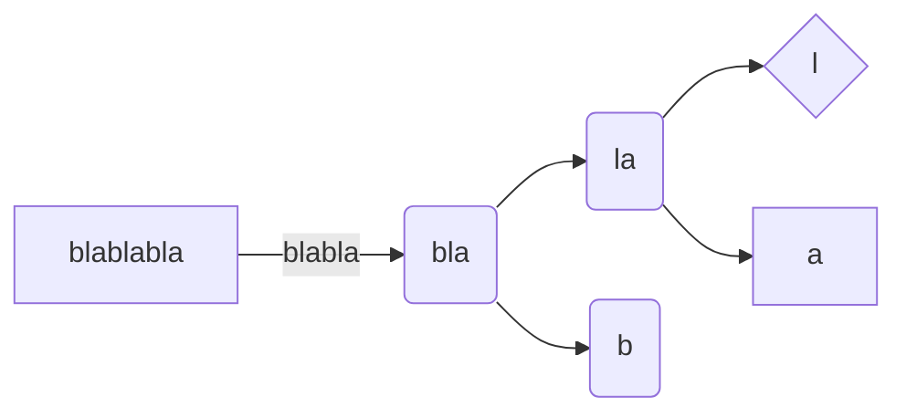
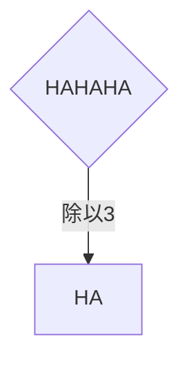

# Markdown 语法指北

markdown语法汇总

标题&段落
-

共有六级标题（这是一段）。

这是另一段。

## 粗体斜体删除线

1）粗体

**粗体方法一**

__粗体方法二__

2）斜体

*斜体方式一*

_斜体方式二_

3）粗斜体

随机对称组合

**_粗斜体示例_**

4）删除线

~~要被删除力~~

## 列表
有序列表、无序列表及其嵌套
* 无序列表1.1
    * 无序列表
    * 无序列表
* 无序列表2.1

- 无序列表1.2
    1. 有序列表1
    2. 有序列表2
    3. 有序列表3
- 无序列表2.2

1. 有序列表
    + 无序列表1.3
    + 无序列表2.3
2. 有序列表

## 引用
> 这是引用了一个段落

> 这是引用了另一个段落的第一行
>
> > 引用的引用
> >
> {style="note"}
> > 第二行
>
> 第三行

## 行内代码

1）普通代码快

    四个空格
    就是一个代码块

<!--

`这也是一个代码块`

2）围栏使代码块及`tab`的用法

例如：

<tabs>
    <tab title="python1">

```Python
import pandas
a = pandas.read_excel('xxx'.xlsx)
```

</tab>
<tab title="python2">

```Python
import numpy

```

</tab>
<tab title="markdown">

~~~
<tab title="xxx">
</tab>
~~~
</tab>
</tabs>

-->

## 分割线

---

`---`

## 超链接

1）连接到网站

[百度](https://baidu.com/)


2）连接到markdown页面标题
<!--
[Markdown  Default-topic](Default-topic.md "点击跳转")
-->
3）同其他元素配合

例如：

[_**`原神`**_](https://ys.mihoyo.com/ "原神，启动！")

## 添加图骗


## 添加侍萍

@[bilibili](BV1ng4SeeEJJ)

## Emoji表情

:smile:

##  表格

| 表头1 | 表头2 | 表头3 |
|-----|-----|-----|
| 内容1 | 内容2 | 内容3 |
| 内容1 | 内容2 | 内容3 |

## 脚注

这是一个脚注[^1]

[^1]: 脚注 **可以包含特殊标记**

## 公式

```tex
a^2 + b^2 = c^2 
```

需要用一句话来使两个式子分开

```tex
x=\frac{-b\mp\sqrt{b^2-4ac}}{2a}
```

## 注释

<!-- 注释 -->

`<!-- 注释 -->`

> `这是xml语言`

## 思维导图




