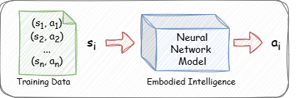

# A Survey of Imitation Learning for Embodied Intelligence

## Introduction

In recent years, artificial intelligence (AI) technologies represented by deep learning (DL) have shined in robotic tasks, and the concept of embodied intelligence has emerged. A typical representative technology among them is Imitation Learning (IL). We know that robots are a bridge between virtual programs and the real world, but in most cases, robots cannot get feedback through the real world, which is the so-called reward. Therefore, the setting of the reward function is crucial. Traditional methods require experts to provide specific, hard-coded rules regarding the actions that a machine must perform, as well as the characteristics of the environment in which the machine operates. However, developing such rules requires considerable time and coding expertise . Therefore, researchers hope that robots can learn human behavior and solve problems in the same way as humans. This is the basic idea of Imitation Learning.

As robotic tasks continue to emerge, researchers have designed imitation learning algorithms with their own characteristics. In this survey, we provide a comprehensive review of imitation learning, aiming to help novices understand its working principles and provide experienced practitioners with the latest developments. Specifically, the survey is organized as follows: In Section 2, we will review the basic concepts of imitation learning in detail, introduce its mathematical formulas, development history, and main advantages. Then, in Section 3, we will explore the performance and effects of imitation learning in practical applications, and focus on its innovative applications in the field of embodied intelligence. Then, in Section 4, we will explain the challenges and limitations of imitation learning. Finally, in Section 5, we will summarize the contents of the entire survey.

## Imitation Learning

The main purpose of Imitation Learning is to enable agents to learn to perform a specific task or behavior by imitating an expert through the provision of demonstrations.It can be divided into two categories: behavior cloning (BC) and inverse reinforcement learning (IRL). Furthermore, we will explore Adversarial Imitation Learning (AIL) algorithms that extend IRL by introducing adversarial environments. We will highlight the benefits of integrating adversarial training into IL and evaluate the current progress in the field of AIL.

### Behavior Cloning

BC is an IL technique that treats the problem of learning a behavior as a supervised learning task. Given the expert state-action pairs, as shown in Figure, the embodied intelligent robot can predict the actions it should take in a particular state by training a classifier or regression model. It can be seen that Behavior cloning is the direct learning strategy through expert demonstration, that is, learning a mapping from state to action.

Obviously, BC has a serious problem, that is, it is very dependent on the data set. Once the robot encounters a scene outside the data set, it will behave uncontrollably, thus losing its reference significance, which is very inappropriate in real applications.

### Inverse Reinforcement Learning

In addition to behavioral cloning, another key approach to imitation learning is Inverse Reinforcement Learning (IRL). The goal of IRL is to infer the reward function from the expert's behavior, that is, the agent learns a reward model so that the expert's behavior is considered optimal under this model. Unlike behavioral cloning, IRL does not directly imitate the expert's actions, but learns the reward function to understand why the expert takes these actions. Once the robot has mastered the reward function, it can use traditional reinforcement learning methods to optimize its own strategy and make better decisions in the same or similar environments.

IRL has been widely used in a variety of applications, such as robotics manipulation, autonomous navigation, game playing, and natural language processing. However, designing an effective and usable IRL is very challenging. There are two important reasons for this.

- IRL can be computationally expensive and resource-intensive. This is partly because the robot needs to continuously learn the correct reward function from the feedback of its interactions with the real world.

- A typical IRL approach follows an iterative process that involves alternating between reward estimation and policy training, which results in poor sample efficiency.

### Adversarial Imitation Learning

The advantages of AIL can well solve some of the limitations of IRL. The first AIL method that gained prominence is known as generative AIL (GAIL) \cite{ho2016generativeadversarialimitationlearning}. GAIL combines generative adversarial networks (GANs) with imitation learning, using a generative adversarial mechanism to approximate the behavior of experts. The generator is responsible for generating actions similar to those of experts, while the discriminator tries to distinguish whether these actions come from experts. Through this adversarial process, the agent can learn behavioral strategies similar to those of experts. Over the years, numerous improvements have been proposed to the original algorithm to improve its sample efficiency, scalability, and robustness, including changes to the discriminator’s loss function and switching from on-policy to off-policy agents

## Applications and Impact

### Algorithm Development and Application

With the raise of Transformers in NLP and CV domains, modern imitation learning methods have adopted Transformers as their backbone. In addition, the application of diffusion model provides advantages for imitation learning. Due to their strong generalization ability and rich representation power to capture multimodal action distributions, they have become the SoTA in the imitation learning domain. Not only that, researchers also tried to combine the mamba model with imitation learning. The introduction of Mamba in an encoder-decoder structure enhances its versatility, making it suitable for standalone use as well as integration into advanced architectures like diffusion processes.

### Combining Simulation With Reality

Recently, several sim-to-real paradigms have been introduced, to mitigate the need for extensive and costly real-world demonstration data by conducting extensive learning in simulation environments, followed by migration to real-world settings.

- Real2Sim2real: It enhanced Imitation learning in real-world scenarios by leveraging reinforcement learning RL trained in a “digital twin” simulation environment

- TRANSIC: It enhances sim-to-real transfer performance through several steps: first, robots are trained using RL to establish foundational strategies within a simulation environment. Then, these strategies are implemented on real robots, with humans intervening and correcting behaviors in real-time via remote control when errors occur.

### Robot Learning and Control

Imitation learning aims to minimize data usage by collecting high-quality demonstrations. To improve data efficiency, reduce interaction costs, and ensure safety, Offline RL + Online RL is proposed. In this approach, offline RL is first used to learn policies from a static large-scale dataset collected in advance. These strategies are then deployed in real environments for real-time interaction and exploration, and adjustments are made based on feedback. The representative Imitation Learning methods from human demonstrations are ALOHA.

## Challenges and Limitations

A common assumption in IL methods is that the demonstrations will be optimal, performed by an expert demonstrator. However, this assumption is too restrictive when it comes to learning from demonstrations in a variety of cases. First, it is very difficult to obtain a large number of high-quality human expert demonstrations, as this requires a lot of time and effort. In addition, humans are easily affected by various factors such as link interference and physical fatigue when performing tasks, which makes the demonstration data lose its reference value to a certain extent. Second, combining demonstration data obtained from different human experts can improve the diversity of the dataset and the stability of the model. However, a crowdsources dataset will inevitably have a wide range of behavior optimality since it is collected from users with varying levels of expertise.

The naive solution to imperfect demonstrations would be to discard the non-optimal ones. However, this screening process is often impractical since it requires significant human effort. Therefore, researchers have been increasingly interested in developing methods that can learn from imperfect demonstrations. By effectively leveraging human demonstration data, robotic systems can achieve higher levels of performance and adaptability, enabling them to more effectively perform complex tasks in dynamic environments.

## Conclusion

Imitation learning has demonstrated significant value in embodied intelligence by enabling robots to efficiently acquire complex behaviors through expert demonstrations. This approach mitigates the necessity for extensive trial-and-error processes and facilitates quicker adaptation to real-world tasks. Nevertheless, challenges persist, including the dependence on high-quality demonstrations and the requirement for improved generalization to novel scenarios. Future advancements in algorithms and data integration are expected to further enhance the capabilities of imitation learning, paving the way for more sophisticated and autonomous robotic systems.